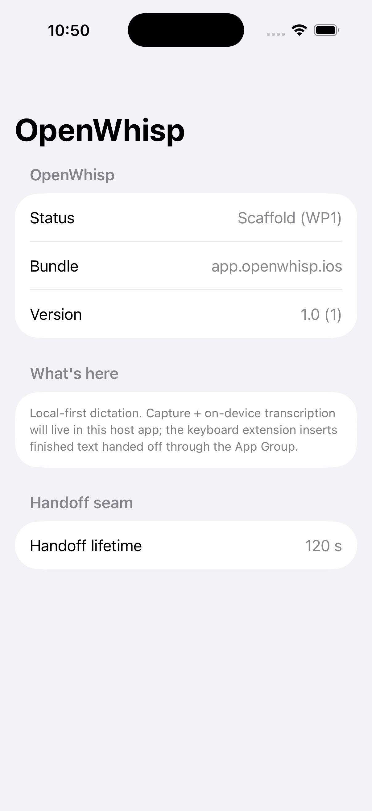
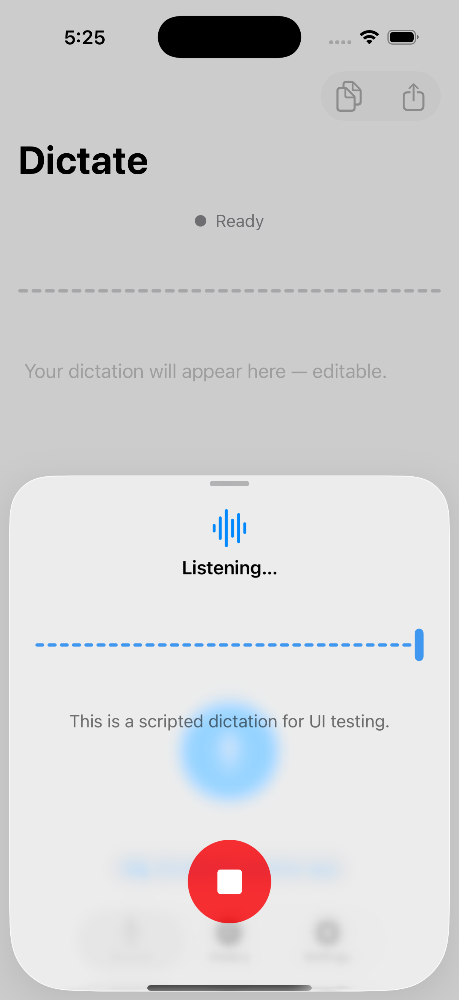

# Testing — the contract for `openwhisp-ios`

Same law as the macOS repo: **every feature ships with an automated test, and
`swift test` on `OpenWhispMobileKit` is the always-green gate.** This doc is the
tiered testing contract — what each tier covers, the exact command to run it,
and what runs in CI vs. locally/nightly.

The tiers mirror the macOS repo's proven approach
([openwhisp `docs/E2E_AUDIO_TESTING.md`](https://github.com/initcore0/openwhisp/blob/main/docs/E2E_AUDIO_TESTING.md)):
fast deterministic logic tests first, real hardware/engines last.

## The tiers at a glance

| Tier | What it proves | Command | Where it runs |
|---|---|---|---|
| **1. `swift test` gate** | All pure logic: `CaptureFlow`, `MicKeyResolver`, `TranscriptInsertPolicy`, handoff store, layout/autocap, sync `plan()`. Deterministic, ~seconds, no simulator. | `./scripts/test.sh` | **CI (blocking)** + every local commit |
| **1b. Fixture integrity** | The checked-in `fixtures/audio/*.wav` are 16 kHz/mono/16-bit and each has a `.txt` reference; the required English + multilingual set is present. | `./scripts/check-fixtures.sh` | **CI (blocking)** |
| **2. Simulator XCUITest** | The app bundle builds, installs, launches, and renders; text entry works via the system keyboard. | `./scripts/uitest.sh` | **CI (separate job)** + local |
| **3. Env-gated real-engine runs** | Real Parakeet/WhisperKit engines transcribe `fixtures/audio/*.wav` on a simulator (loose WER). Downloads models on first run. | `./scripts/e2e-engines-sim.sh` (the script opens the gate itself) | **Local / nightly (not blocking)** |
| **3b. Sync loopback (real TLS)** | The `SyncEngine` runs a full manifest → plan → pull/push → apply over a **real TLS-PSK `NWConnection`** to the Mac loopback harness on `127.0.0.1`; asserts vocab/history merge both ways and a second sync is a no-op. Self-skips without the harness. | `OPENWHISP_SYNC_E2E=1` + the mac repo's `scripts/sync-loopback-server.sh`, then `./scripts/test.sh` | **Local / integration (not blocking)** |
| **4. Real-device checklist** | Hero-flow spikes, memory/latency/thermals, keyboard-extension enablement, cross-device sync — things a simulator cannot prove. | Manual (see below) | Human, pre-release |

### Tier 1 — the `swift test` gate

```sh
./scripts/test.sh          # swift test on Packages/OpenWhispMobileKit
```

The workhorse. Fixture WAVs are replayed here through the pipeline with a
**scripted** engine (canned text) so assertions are exact and independent of ASR
accuracy — see the macOS `FeatureMatrixE2ETests` pattern. Real-engine replay
lives in Tier 3, not here. Anything you can express as pure logic belongs in
this tier; if a feature's logic is trapped on an AppKit/UIKit shell, extract a
pure resolver into `MobileCore`/`KeyboardCore` first (the macOS repo's
`ProfileResolver`/`LanguageResolver` move).

### Tier 1b — fixture integrity

```sh
./scripts/check-fixtures.sh    # validate the committed fixtures (no `say` needed)
./scripts/gen-fixtures.sh      # regenerate them (macOS only; needs `say`)
./scripts/gen-fixtures.sh --check   # format-drift guard
```

`check-fixtures.sh` uses pure `python3` to read each WAV header, so it runs
anywhere (including a Linux CI box) without macOS audio tools. It fails CI if a
fixture is corrupt, in the wrong format, missing its `.txt` sidecar, or if the
required English set / all multilingual fixtures are absent. Provenance and the
**loose-WER expectations** for the synthetic multilingual clips are documented
in [`fixtures/README.md`](../fixtures/README.md) — synthetic TTS is not natural
speech, so real-engine assertions on these use loose WER / key-phrase
containment only.

### Tier 2 — simulator XCUITest

```sh
./scripts/uitest.sh                    # both suites on the default simulator
./scripts/uitest.sh OpenWhispUITests   # just the host-app smoke
OPENWHISP_SIM_DEVICE="iPhone 17 Pro" OPENWHISP_SIM_OS="26.5" ./scripts/uitest.sh
```

To just *see* the app on a simulator (build + install + launch, no tests):

```sh
./scripts/run-sim.sh    # opens Simulator.app, launches the host app, drops a
                        # screenshot at .build/run-sim-launch.png
```

The host app launched on an iPhone 17 (iOS 26.5) simulator via `run-sim.sh`:



Three suites:

- **`OpenWhispUITests`** (`Apps/UITests/HostSmoke/`) — launches the **real host
  app** and asserts the placeholder home renders (nav title, the
  `LabeledContent` status/bundle/version rows). This is the end-to-end proof the
  bundle installs, links `OpenWhispMobileKit`, and reaches its first screen —
  the layer `swift test` can't cover.
- **`DictationHandoffUITests`** (`Apps/UITests/Handoff/`) — drives the whole
  **floor flow** (ARCHITECTURE §5.2) on the simulator with the DEBUG scripted fake
  engine (`-openwhisp-uitest-fake-engine` + `-openwhisp-uitest-open-dictate`): the
  compact **dictation sheet** appears, the fake finishes through the real
  `SilenceAutoStop` path, and the sheet reaches the published/"return to your app"
  state carrying the scripted transcript — no mic, no model, deterministic. The
  REAL `openwhisp://dictate` URL delivery is exercised manually (see
  `run-sim.sh` + the R0b checklist), which can't be made hermetic in XCUITest.

  The dictation sheet driven by the deep-link route on an iPhone 17 (iOS 26.5)
  simulator (scripted fake engine):

  
- **`UITestHostUITests`** (`Apps/UITests/Typing/`) — types `Hello, world!` into a
  text field with the **system keyboard** and asserts it lands. It targets a
  tiny dedicated harness app (`Apps/UITests/Host/`, target `UITestHost`), not the
  shipping host app, so the test is deterministic and can't drift as the host UI
  evolves.

**Why the typing test does NOT enable our keyboard extension.** Enabling a
custom keyboard programmatically via XCUITest — driving Settings ▸ General ▸
Keyboard ▸ Keyboards ▸ Add New Keyboard, then toggling **Allow Full Access** — is
notoriously flaky across iOS versions and simulator states (the Settings UI
hierarchy shifts, Full-Access toggles present confirmation alerts, and the
switch doesn't always take on a fresh simulator). Shipping that as a CI test
would trade a real signal for intermittent red. So Tier 2 proves **system**
text entry (the prerequisite plumbing), and **our keyboard extension is
validated on a real device via the Tier-4 checklist** below. When WP4/WP5 add
keyboard behavior, its *logic* is tested in `KeyboardCoreTests` (Tier 1); only
the on-device enablement + insertion is manual.

### Tier 3 — env-gated real-engine runs

```sh
./scripts/e2e-engines-sim.sh
```

Runs the package test suite (scheme `OpenWhispMobileKit-Package`, synthesized
by xcodebuild from the package directory) on a **simulator** destination — real
Parakeet/WhisperKit link CoreML and cannot run in the Foundation-only
`swift test` gate. The script opens the gate by passing
`TEST_RUNNER_OPENWHISP_E2E_ENGINES=1` to xcodebuild: the `TEST_RUNNER_` prefix
is how an env var actually reaches the test process (a plain exported var or a
trailing `KEY=VALUE` arg does **not** arrive — that dead-gate bug was caught in
review). The engine tests read `OPENWHISP_E2E_ENGINES` from their environment
and self-skip when it is absent, so plain `swift test` stays green and fast.

**⚠️ First run downloads model weights** (Parakeet variants / WhisperKit
tiny·base·small) from the network, cached thereafter — expect minutes and
bandwidth on the first invocation. That's why this tier is **local/nightly, not
the blocking CI gate.** Assert against `fixtures/*.txt` only with **loose WER /
key-phrase containment** (see `fixtures/README.md`), never exact equality —
ANE/GPU float non-associativity makes transcripts differ across machines.

### Tier 3b — sync loopback (real TLS-PSK, no Mac needed)

The pure sync logic — the merge policy, the `SyncPlanner.plan`, the manifest
builder — is all Tier 1 (`SyncCoreTests`), and the whole `SyncEngine` loop
(manifest → plan → pull/push → apply → idempotent re-sync) is proven in-process
against a fake peer (`SyncKitTests/SyncEngineTests`). Tier 3b is the one thing
those can't prove: **the real wire**. It arms the *same* TLS 1.3-capable PSK the
phone uses, connects a real `NWConnection` to the Mac loopback harness on
`127.0.0.1`, handshakes over the Agent Bridge, and runs a full sync — asserting
vocabulary + history merge both ways and that a second sync moves nothing.

```sh
# In the openwhisp (mac) repo — start the harness (prints READY):
OPENWHISP_SYNC_PSK="$(openssl rand -base64 32)" \
OPENWHISP_SYNC_PORT=8770 \
OPENWHISP_SYNC_FIXTURE_DIR=/path/to/seed \
  ./scripts/sync-loopback-server.sh

# In this repo — point the gated test at it and run the package suite:
OPENWHISP_SYNC_E2E=1 \
OPENWHISP_SYNC_PSK="<same base64 psk>" \
OPENWHISP_SYNC_PORT=8770 \
  ./scripts/test.sh
```

Without `OPENWHISP_SYNC_E2E=1` (or the harness), `LoopbackSyncE2ETests`
**self-skips** cleanly, so it never flakes the blocking Tier-1 gate. A dedicated
integration agent runs the two repos together; day to day, the in-process
`SyncEngineTests` + the hermetic `TLSPSKLoopbackTests` (which stand up a local
TLS-PSK listener and prove the handshake + a wrong-key rejection) cover the wire.

> **TLS version note.** The transport targets TLS 1.3 but sets a **1.2 floor**:
> Network.framework's external-PSK API negotiates the TLS-1.2 PSK-DHE suites
> today (verified on the current SDK), and rises to 1.3 automatically once the
> platform wires external PSK through it. Either way the posture is mutual-PSK
> auth, ephemeral-DH forward secrecy, no CA, nothing readable pre-handshake — see
> `SyncKit/TLSPSK.swift`.

### Tier 4 — real-device checklist (manual, pre-release)

A simulator cannot exercise the microphone, the Neural Engine, background-capture
intents, custom-keyboard enablement, thermals, or a paired Mac. These are
human-run on a physical iPhone (iOS 18+). Build/run on device with a team:

```sh
DEVELOPMENT_TEAM=XXXXXXXXXX xed .    # then Run on your iPhone in Xcode
```

(see the **Device builds** note in [../README.md](../README.md) — the generated
project carries the literal `${DEVELOPMENT_TEAM}` build setting, so Xcode only
resolves a team when launched with the env var).

#### WP5 hero-flow device checklist (R0a/R0b/R0c — the unverifiable-on-simulator matrix)

WP5 ships the hero surfaces (App Intents + Live Activity + Control Center) and the
floor flow. The simulator proves the floor flow end to end (Tier 2
`DictationHandoffUITests`) and all the handoff logic (Tier 1). What ONLY a real
device can prove is whether `AudioRecordingIntent` actually starts capture from
each surface/app-state. The code is structured so **every cell below is testable**:
`StartDictationIntent.perform()` calls `IntentDictationBridge.begin()`, which
returns whether capture reached a live state; when it returns false the intent
degrades to opening the app (the floor sheet). Record verbatim pass/fail per cell
into `docs/SPIKE_RESULTS.md`.

The host app now declares `UIBackgroundModes: [audio]` (project.yml). That changes
what this matrix expects:

- **Background CONTINUATION is now expected to WORK** and is no longer an R0a
  unknown. A dictation STARTED in the foreground (floor flow, or a hero start while
  frontmost) must keep capturing + finish transcribing after the user switches back
  to their target app. Verify this explicitly (see the "continuation" row below); a
  failure here is now a bug, not an accepted degradation.
- **Background/not-running START** remains the R0a unknown: whether an
  `AudioRecordingIntent` can *begin* `AVAudioEngine` capture from a background or
  cold-launched process is what only a device run settles.

**R0a — `AudioRecordingIntent` capture-start matrix.** For each cell: press the
trigger, then observe — did capture start (Live Activity shows "Listening…", a
transcript later lands in the App Group), or did it degrade to opening the app, or
fail silently? Note the failure mode verbatim.

| App state \ Trigger | Action button | Control Center | Shortcuts app |
|---|---|---|---|
| **Foregrounded** | ☐ | ☐ | ☐ |
| **Backgrounded (START)** | ☐ | ☐ | ☐ |
| **Not running (START)** | ☐ | ☐ | ☐ |
| **Foreground start → background CONTINUATION** (switch away mid-capture; expect it FINISHES) | ☐ | ☐ | ☐ |

For each cell capture, per trial: (1) did `StartDictationIntent` run? (2) did
`AVAudioEngine` capture actually start (or was session activation denied in the
background)? (3) did the Live Activity appear? (4) did the transcript publish? (5)
if start failed, what did the degradation actually look like? Be honest here: the
bridge's open-app fallback only ROUTES the dictation sheet — it cannot foreground
the app (there is no iOS-18 API for a non-`openAppWhenRun` intent to do so). So
expect: app already foreground → the sheet appears; app backgrounded → the sheet is
queued invisibly and only shows when the user next opens OpenWhisp themselves.
Record which of those each failed cell exhibited. *Gate:* if background/not-running START fails on a surface, the
hero copy for that surface degrades to "opens OpenWhisp to dictate" (the floor
flow); update `ARCHITECTURE.md` §5's hero-status line with what actually holds. The
CONTINUATION row is a hard pass expectation now that `UIBackgroundModes: [audio]`
is declared — if it fails, the background-audio entitlement is not taking effect.

Also verify: **mic-permission-denied** start (should return false → open app to
resolve), and the **Live Activity Stop button** ends capture + publishes (fires
`StopDictationIntent` → `IntentDictationBridge.stop()`). Because `StopDictationIntent`
conforms to `LiveActivityIntent`, its `perform()` runs in the APP process (where the
bridge handlers live), not the widget process — confirm the tap actually stops the
live capture and doesn't no-op.

**R0b — keyboard→host trigger.** (a) Walk the manual app-switch UX end to end:
keyboard mic key → user opens OpenWhisp (or a Shortcut fires `openwhisp://dictate`)
→ dictation sheet → speak → return via the back-breadcrumb → keyboard inserts on
reappear. (b) Test the responder-chain `openURL:` hack — compiles/works on
iOS 18/26? Note the App-Review risk regardless ([C9]). *Gate:* decision recorded in
`ARCHITECTURE.md` §5.

**R0c — round-trip insert.** Publish a `PendingTranscript` from the host →
`DarwinHandoffNotifier` ping while the keyboard is live (measure insert latency +
miss rate over 20 trials); and App-Group read on keyboard reappear after an
app-switch (20 trials). Also confirm the coarse `FileSharedStateStore` capture
state the host writes (`capturing`→`transcribing`→`idle`) is what the keyboard's
mic key reads. *Gate:* confirms the store-read fallback + 120 s expiry mitigations
hold.

#### Keyboard-extension enablement (manual — the flaky path Tier 2 skips)

1. Settings ▸ General ▸ Keyboard ▸ Keyboards ▸ Add New Keyboard ▸ **OpenWhisp**.
2. Type in Notes/Safari with Full Access **OFF** — the keyboard must be fully
   functional as a plain keyboard (guideline 4.4.1). Confirm globe switches out.
3. Enable **Allow Full Access**; confirm the App-Group handoff + dictation
   affordance behave per `MicKeyResolver`.

#### Engine benchmark matrix (WP3) & sync (WP6)

- **Benchmarks:** peak RSS, time-to-first-token, real-time factor, thermal state
  for the candidate models on ≥2 real devices → `docs/BENCHMARKS.md`; picks the
  `recommendedDefault(for:)` table. Keyboard extension idle RSS must stay under
  budget (WP4).
- **Sync:** edit vocabulary on the Mac → sync → phone dictation applies it;
  history flows both ways — against a real paired Mac.

## What runs in CI

[`.github/workflows/ci.yml`](../.github/workflows/ci.yml), macOS runner, on every
push/PR:

| Job | Tier | Blocking |
|---|---|---|
| `package-tests` | 1 (`./scripts/test.sh`) | ✅ yes |
| `fixtures` | 1b (`./scripts/check-fixtures.sh`) | ✅ yes |
| `simulator-build` | builds all three product targets unsigned | ✅ yes |
| `simulator-uitest` | 2 (`./scripts/uitest.sh`) — separate job so a UI-test flake is attributable and doesn't mask a logic regression | ✅ yes (own job) |

**Not in CI:** Tier 3 (downloads models, minutes-long — nightly/local) and
Tier 4 (needs real hardware). The simulator UI-test job is a **separate** job
from `package-tests` on purpose: if the simulator flakes, you can tell it apart
from a real logic failure at a glance.

## Adding a test for a new feature (the rule of thumb)

1. **Pure logic first.** Put the decision in a Foundation-only type in
   `MobileCore`/`KeyboardCore` and unit-test it (Tier 1). If it's trapped on a
   UIKit/SwiftUI shell, extract a resolver first.
2. **Drive it from a fixture** if it touches the audio pipeline — replay a WAV
   through the pipeline with a scripted engine and assert the observable effect.
   Add a new fixture (+ `.txt`) to `scripts/gen-fixtures.sh` if needed, then
   `./scripts/check-fixtures.sh`.
3. **Real engine / real device only if the feature demands it** — add to Tier 3
   (`e2e-engines-sim.sh`) or the Tier-4 checklist.

A feature without a test is not done.
